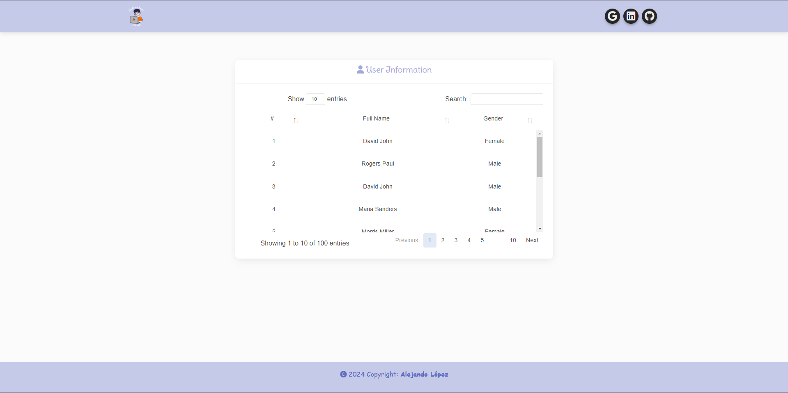

# <h1 align="center" style="color: #80cbc4;"> Data Tables 👨🏻‍💻 </h1> 
  

` DataTables ` is a jQuery plugin that allows you to add functionality to HTML tables, such as searching, sorting, editing and navigating data.  
The following web program displays random user data using data tables for an enhanced view.

    

  

## 
 Requirements 

- [HTML5](https://developer.mozilla.org/es/docs/Web/HTML) 
- [CSS3](https://developer.mozilla.org/es/docs/Web/CSS)
- [PHP](https://www.php.net/manual/es/intro-whatis.php)
- [JavaScript](https://developer.mozilla.org/es/docs/Web/JavaScript)
- [BootStrap](https://mdbootstrap.com/)
- [Data Tables](https://datatables.net/)

  

## 
 Screenshot Project 💻 

<!-- 🔶 [Project Website]() -->

